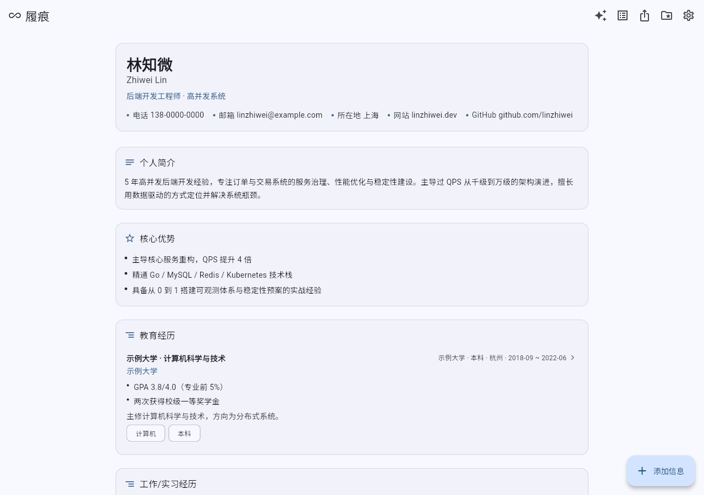
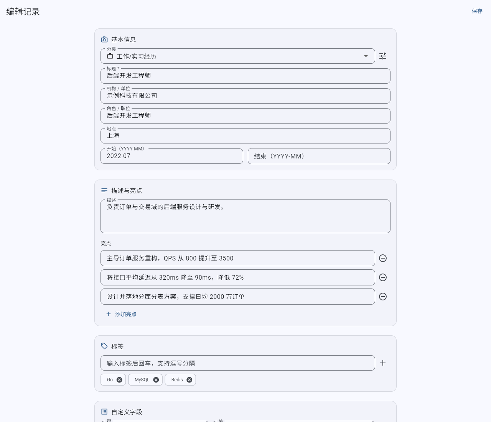
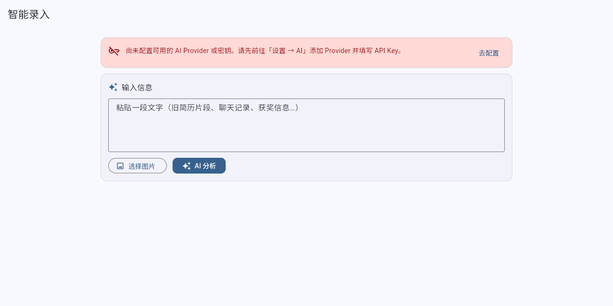
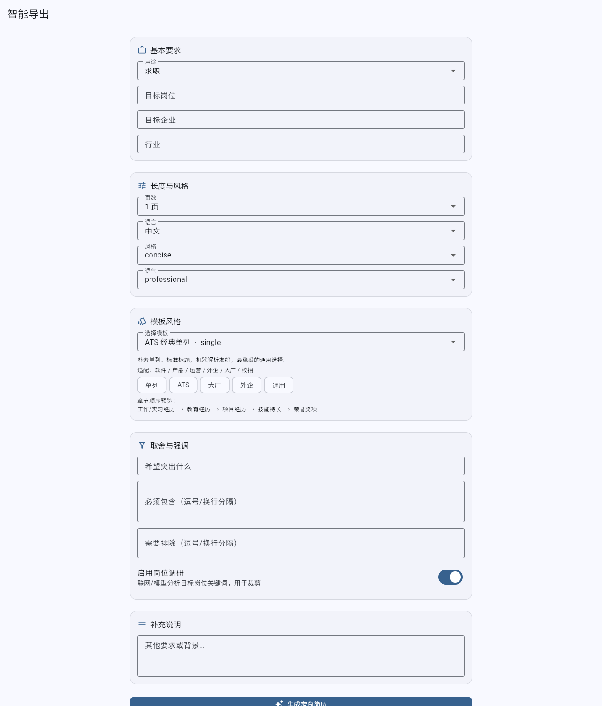
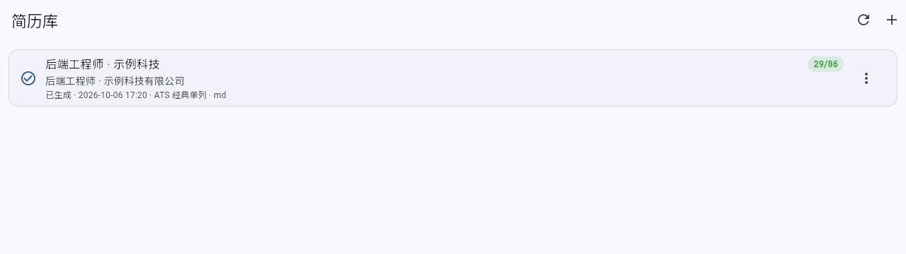
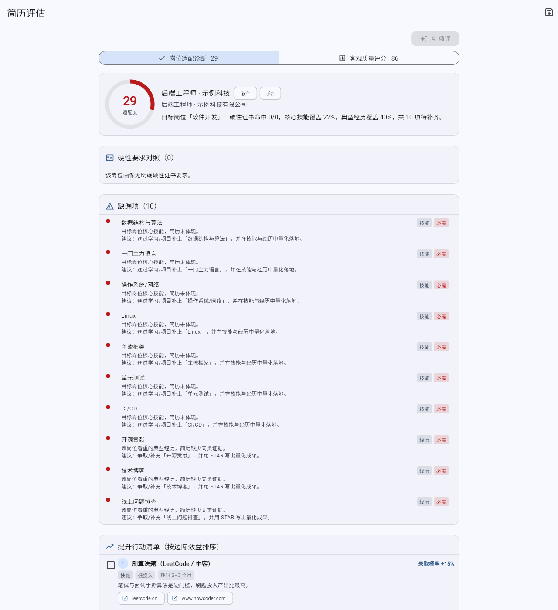

# Lifeline · 履痕

> 跨平台（Android / Windows / Linux / Web）个人资料管理软件：把散落的个人经历沉淀为**可挂载、可 diff、可被任意工具同步的纯文本文件夹**，聚合成一份**不断自动编译的完整简历**，并支持 AI 自动录入、按岗位定向导出（多模板 Typst→PDF / DOCX / Markdown）与简历评估。

仓库：`EaveBounty/Lifeline` ｜ 许可：**PolyForm Noncommercial License 1.0.0**
版权：**长沙市果垂素宇工程设计有限公司**

<p>
  
</p>

---

## 目录

- [1. 项目定位](#1-项目定位)
- [2. 核心特性](#2-核心特性)
- [3. 截图](#3-截图)
- [4. 数据挂载与同步理念](#4-数据挂载与同步理念)
- [5. 目录结构](#5-目录结构)
- [6. 数据格式简述](#6-数据格式简述)
- [7. 技术栈](#7-技术栈)
- [8. 构建与运行](#8-构建与运行)
- [9. 首次启动](#9-首次启动)
- [10. CI 说明](#10-ci-说明)
- [11. 文档索引](#11-文档索引)
- [12. 许可与署名](#12-许可与署名)
- [13. 路线图](#13-路线图)
- [变更日志](#变更日志)

---

## 1. 项目定位

**问题**：个人资料（教育、工作、项目、奖项、论文、证书、附件……）散落在聊天记录、旧简历、云笔记、硬盘目录里；每次求职都要重新拼凑、重复填写、格式不一，且数据被锁死在某个软件里。

**Lifeline 的答案**：

- **数据即文件**：所有资料以 JSON / YAML / 附件文件存在你**自己选择的同步根目录**里，软件不拥有数据。
- **单一真相源**：JSON 是真相源，SQLite 只是**可 100% 重建的索引**，YAML 存设置；删除索引不丢数据。
- **软件不碰同步**：App 只读写文件夹，同步交给 Syncthing / WebDAV / Git 等你熟悉的工具。
- **简历自动编译**：任何数据变更 → 首页完整简历实时重编译（纯函数 `DB → ResumeDocument`）。
- **AI 自动录入**：粘贴文字或拍照 → 抽取为结构化记录（严格 JSON + 人工确认）。
- **按岗位智能导出**：问卷 + 岗位调研 → 定制裁剪 → Typst→PDF（精美）+ DOCX（ATS 单列）+ Markdown（可版本对比）。

设计原则（详见 [`ARCHITECTURE.md`](ARCHITECTURE.md) §1）：数据/配置与软件解耦、软件不做同步、文本优先可 diff、禁止私自创建目录、一切可重建、编译即纯函数、平台能力抽象、安全默认。

---

## 2. 核心特性

| 特性 | 说明 |
|---|---|
| 外部挂载同步根 | 首启必须由用户亲自选择目录；空目录需二次确认后初始化 |
| 一条一文件 | 每条记录一个 `<uuid>.json`，最大化降低多端同步冲突 |
| 纯文本真相源 | JSON / YAML 可被 Git 合并、Syncthing 同步、任意编辑器修改 |
| 可重建索引 | `drift` + SQLite 索引，损坏或删除后从 JSON 全量重建 |
| 首页完整简历 | Flutter 原生渲染，实时反映数据，非导出文件 |
| 多格式导出 | Typst→PDF（桌面精美）、纯 Dart PDF 兜底（全平台）、DOCX（ATS）、Markdown |
| AI 自动录入 | 文本 / 图片（vision）→ 严格 JSON → 人工确认落库 |
| 自动编译 | 文件监听 + 轮询兜底 + debounce，变更即重编译 |
| 按岗位定向导出 | 岗位调研 → 裁剪策略 → 生成 `spec.json` → 多模板渲染 → 归档简历管理 |
| 导出模板 | 10 套风格（ATS 单列 / 现代双栏 / 学术 CV / 应届生 / 教师 / 创意 / 商务 / 技术紧凑 / 优雅衬线 / 极简），按目标岗位智能推荐；桌面 Typst 精品、全平台 DartPdf 兜底、DOCX/Markdown |
| 简历评估（一体两面） | ① **岗位适配诊断**：对照岗位能力画像与硬性要求找缺漏（教师缺教资、算法缺竞赛…），给出**按边际效益排序**的提升行动与资源；② **客观质量评分**：多维打分（启发式离线 / AI）。结果写回 `meta.json` |
| 密钥安全 | `flutter_secure_storage`，Linux 缺失 keyring 时降级为受权限文件并显式提示 |
| 离线优先 | 无网络可用；云端能力（LLM/联网调研）均为可选增强 |

---

## 3. 截图

> 以下为 Web 构建产物（`flutter build web --release`）的真实运行截图，由
> `tool/web_test/run.sh`（Playwright 端到端测试）自动生成；均为 1280px 宽。

| 界面 | 预览 |
|---|---|
| 首启选择同步根 |  |
| 首页完整简历 |  |
| 记录编辑 |  |
| AI 自动录入 |  |
| 定向导出问卷 |  |
| 简历管理 |  |
| 简历评估（岗位适配 + 客观质量） |  |

### 运行浏览器端到端测试

```bash
bash tool/web_test/run.sh   # 构建(如需) → 起本地服务 → Playwright 测试 + 重新生成截图
```

脚本以无头 Chromium 加载本地 web 构建，收集 `console`/`pageerror` 并断言 0 错误，
校验各页面关键文本与语义，执行一次真实点击交互，并用 ImageMagick 校验截图非空白。

---

## 4. 数据挂载与同步理念

**核心主张：Lifeline 不做同步。** 同步是成熟工具已解决的问题，不应在应用内重复造轮子、也不应把用户的资料锁进私有协议。Lifeline 只保证一件事：**同步根目录里的数据格式对同步/版本工具友好**（一条一文件、原子写、纯文本、无二进制真相源）。

三种推荐方案对比：

| 维度 | Syncthing | WebDAV（坚果云 / Nextcloud / 群晖等） | Git |
|---|---|---|---|
| 部署 | P2P 直连，无需服务器 | 自建或使用现有云盘 | 自建远端或使用 GitHub/GitLab 私有库 |
| 离线 | 局域网/离线可用 | 依赖服务可用性 | 本地提交离线，推送需网络 |
| 冲突处理 | 双方各留副本 `*.sync-conflict-*` | 客户端保留冲突副本，行为依客户端 | 分支合并 + `.conflict` 兜底 |
| 版本历史 | 有（版本化） | 视服务而定 | **最强**（每次提交即快照） |
| 附件（大文件） | 好 | 好（受配额限制） | 差（大二进制进历史会膨胀） |
| 移动端 | Android 官方 App | 官方/第三方 App | 需 Termux 等，体验一般 |
| 隐私 | 端到端（自持设备） | 取决于服务商 | 取决于远端（自建最可控） |
| 适合 | 多设备自动同步 | 有现成云盘、跨网络 | 需要历史/审阅/回溯 |

**推荐组合**：

- 日常多端自动同步 → **Syncthing**（附件走同一根，简单）。
- 已有云盘 → **WebDAV**（注意配额与冲突副本）。
- 需要版本历史 / 多设备审阅 → **Git**，并 **`.gitignore` 掉 `data/index.sqlite`**（可重建，不进历史）。

> 详细逐步配置、冲突与合并策略见 [`docs/SYNC.md`](docs/SYNC.md)。

---

## 5. 目录结构

```
lifeline/
├── ARCHITECTURE.md          # 唯一权威蓝图（目录/数据/模块/编译/CI）
├── README.md  LICENSE  COMMERCIAL.md  NOTICE  CHANGELOG.md
├── pubspec.yaml  analysis_options.yaml  .gitignore  .metadata
├── docs/
│   ├── research/            # 01-flutter-stack.md  02-resume-compile.md（选型调研）
│   ├── DATA_FORMAT.md       # 磁盘数据格式权威说明
│   ├── SYNC.md              # Syncthing / WebDAV / Git 指南
│   ├── DEV.md               # 开发 / 构建 / 打包 / 常见坑
│   └── AI_PIPELINE.md       # AI 录入 / 编译 / 导出 提示词与流程
├── assets/
│   ├── fonts/               # 内嵌字体（OFL），含 CJK
│   ├── typst/               # 简历模板（.typ）+ 许可说明
│   └── icons/
├── lib/
│   ├── main.dart  app.dart
│   ├── core/                # constants / result / logging / utils / theme
│   ├── data/                # models / json_store / db / config / repositories
│   ├── features/            # onboarding / home / records / attachments / settings
│   │                        # ai / export / sync_guide
│   ├── services/            # ai / compile / render / watch / import_export
│   └── l10n/                # app_zh.arb  app_en.arb
├── test/  tool/  .github/workflows/
└── android/  windows/  linux/
```

> 完整目录与模块边界以 [`ARCHITECTURE.md`](ARCHITECTURE.md) §3 为准。

**同步根目录（用户数据，App 外挂）**：

```
<SyncRoot>/
├── lifeline.yaml            # 设置（无密钥，可安全同步）
├── data/
│   ├── profile.json         # 单例信息表
│   ├── records/<category>/<uuid>.json   # 一条一文件
│   ├── index.sqlite         # 派生索引（可重建，建议 gitignore）
│   └── resumes/<id>/{meta.json,spec.json,resume.pdf,resume.docx,resume.md}
├── attachments/<yyyy>/<sha1[-8]>-<原文件名>
└── .lifeline/state.json     # schema 版本 / 迁移 / 最近编译状态
```

> 密钥降级文件 `secrets.local.json` **不在同步根内**，位于 App 支持目录，默认不同步。
> 启动时会 `probe` 校验记忆的同步根；失效则清空并回到首启页。

---

## 6. 数据格式简述

- **真相源**：`profile.json`、`data/records/**/*.json`、`data/resumes/**/meta.json|spec.json`、`lifeline.yaml`、`.lifeline/state.json`。
- **Record**：`category`（education/experience/projects/awards/publications/certificates/skills/…）、`title`、`organization`、`role`、`start_date`/`end_date`、`description`(Markdown)、`highlights[]`(STAR 量化)、`tags[]`、`fields{}`(分类专属键值)、`attachments[]`(相对路径)、`links[]`、`source{}`、`ai{}`、`created_at/updated_at`、`status`、`order`。
- **附件**：文件本身 + 记录内相对路径数组为真相源；SQLite `attachments` 表仅为可重建索引。
- **写入**：一律**先写临时文件再原子 rename**；冲突时保留 `.conflict` 副本，绝不静默覆盖。
- **索引**：`drift` 在启动与文件变更时增量重建；删除 `index.sqlite` 可 100% 恢复。

> 权威 schema、分类枚举、迁移与冲突细则见 [`docs/DATA_FORMAT.md`](docs/DATA_FORMAT.md)（与 `ARCHITECTURE.md` §4 对齐）。

---

## 7. 技术栈

版本以 `pubspec.yaml` / `pubspec.lock` 为准；选型依据见 [`docs/research/01-flutter-stack.md`](docs/research/01-flutter-stack.md)。

| 层 | 选型 | 版本（基线） | 许可 |
|---|---|---|---|
| 语言/框架 | Flutter / Dart | 3.44.3 / 3.12.2 | BSD-3-Clause |
| 状态管理 | `flutter_riverpod` | ^3.0.0 | MIT |
| 路由 | `go_router` | ^18.0.2 | BSD-3-Clause |
| 结构化索引 | `drift` + `drift_flutter` | ^2.28.0 / ^0.2.4 | MIT |
| YAML | `yaml` + `yaml_edit` + `yaml_writer` | ^3.1.3 / ^2.2.2 / ^2.1.0 | MIT / BSD-3 |
| 密钥 | `flutter_secure_storage` | ^9.2.2 | BSD-3-Clause |
| 文件/目录选择 | `file_picker` | ^8.1.0 | MIT |
| 图片 | `image_picker`（移动）+ `file_picker`（桌面） | ^1.1.2 | BSD-3-Clause |
| PDF 通用 | `pdf` + `printing` | ^3.11.1 / ^5.13.2 | Apache-2.0 |
| PDF 桌面精品 | Typst 二进制 | 0.15.1 | Apache-2.0 |
| PDF 安卓 | Typst FFI（起步 `typst_flutter`，锁版） | 3.0.0 | Apache-2.0 |
| DOCX | `docx_template`（模板法）→ 手写 OOXML 兜底 | — | MIT |
| FS 监听 | `watcher` + polling 兜底 | ^1.1.0 | BSD-3-Clause |
| Markdown | `flutter_markdown_plus` | ^1.0.3 | BSD-3-Clause |
| HTTP / LLM | `dio` | ^5.7.0 | MIT |
| 桌面窗口 | `window_manager` | ^0.4.3 | MIT |
| 工具 | `uuid` `crypto` `csv` `intl` `logging` `path` `path_provider` `url_launcher` | — | MIT / BSD-3 |
| 字体 | 内嵌 OFL CJK + Latin（子集化） | — | OFL-1.1 |

> 完整第三方登记见 [`NOTICE`](NOTICE)；依赖核对与许可聚合流程见 `NOTICE` §D。

---

## 8. 构建与运行

### 8.1 前置环境

- **Flutter 3.44.3 stable（含 Dart 3.12.2）** —— 环境必须匹配，`go_router ^18` 要求 Flutter ≥ 3.44。
- **Android**：Android SDK + Build-Tools；Typst FFI 路线需 **NDK r27+**。
- **Linux**：系统依赖 `libsecret-1-dev`、`libjsoncpp-dev`（`flutter_secure_storage` 编译期）；运行时需 gnome-keyring/kwallet（缺失时应用降级）；`file_picker` 需 `zenity`/`qarma`/`kdialog` 之一。
- **Windows**：Visual Studio 2022（含 Desktop development with C++）与 CMake（Flutter Windows 工具链）。

> 详见 [`docs/DEV.md`](docs/DEV.md)（含环境搭建与常见坑）。

### 8.2 获取依赖与代码生成

```bash
flutter pub get
dart run build_runner build --delete-conflicting-outputs   # drift 代码生成
flutter gen-l10n                                           # 生成本地化
```

### 8.3 运行（开发）

```bash
flutter run -d android      # Android 设备/模拟器
flutter run -d linux        # Linux 桌面
flutter run -d windows      # 仅在 Windows 主机
```

### 8.4 构建产物

| 平台 | 命令 | 产物 |
|---|---|---|
| Android | `flutter build apk --release`（或 `appbundle`） | `build/app/outputs/flutter-apk/app-release.apk` |
| Linux | `flutter build linux --release` | `build/linux/*/release/bundle/` |
| Windows | `flutter build windows --release` | `build/windows/*/runner/Release/` |

> **重要：Windows 产物必须在 Windows runner / Windows 主机构建。**
> Flutter **不支持交叉编译**；在 Linux 上无法产出 Windows 可执行文件。因此 Windows 产物由 CI 的 `windows-latest` 矩阵任务构建（见 §10）。

### 8.5 Typst 与字体（构建期）

```bash
bash tool/fetch_typst.sh     # 拉取对应平台 Typst 0.15.1 二进制到 assets/typst/bin/
```

CJK 字体 `assets/fonts/DroidSansFallbackFull.ttf`（Apache-2.0，见 `NOTICE` §B.3）随包内嵌，
由 `FontResolver` 经 `rootBundle.load` 读取；`pubspec.yaml` 已声明 `assets/fonts/`，中文 PDF 不再缺字。

### 8.6 简历模板与版式

导出问卷新增「模板风格」选择：`ResumeTemplates`（`lib/services/render/templates.dart`）内置 **10 套**模板，
按岗位推荐并全链路透传到各渲染器。`DartPdfRenderer` 真正实现 5 种版式（single / two-column /
academic / creative / compact），`TypstRenderer` 提供 single / two-column / academic / creative 四套模板串；
DOCX / Markdown 接受模板参数（DOCX 保持单列 ATS，可选「modern」彩色标题）。

| 模板 id | 风格 | 版式 | 适配 |
|---|---|---|---|
| `ats-classic` | ATS 经典单列 | single | 通用/大厂/外企 |
| `modern-two-col` | 现代双栏 | two-column | 互联网/技术/产品 |
| `academic-cv` | 学术 CV | academic | 科研/读研/教职 |
| `fresh-graduate` | 应届生一页 | compact | 校招/实习 |
| `teacher` | 教师版 | compact | 教育/教研 |
| `creative` | 创意设计 | creative | 设计/视觉/UI |
| `business` | 商务简约 | elegant | 金融/咨询/法务 |
| `tech-compact` | 技术紧凑 | compact | 算法/后端/数据 |
| `elegant-serif` | 优雅衬线 | elegant | 管理/市场 |
| `minimal-mono` | 极简单色 | mono | 通用/国企 |

> 模板仅影响渲染层，不改变 `ResumeDocument` IR；未知/空 id 回退 `ats-classic`。

---

## 9. 首次启动

1. 启动检查本地 App 配置中的 `sync_root`（本地配置**不在同步根内**）；经 `RootManager.probe` 校验，失效则清空并回到首启页。
2. 无 → 进入**同步根选择页**：必须由用户**亲自选择**目录。
3. 目录已含 `lifeline.yaml` → 直接打开；目录为空 → 弹出「是否在此初始化 Lifeline 结构？」二次确认后创建。
4. 初始化 `data/`、`attachments/`、`.lifeline/state.json`，并写入本地 App 配置。

> 软件**绝不擅自创建目录**（原则 P4）。同步建议见 [`docs/SYNC.md`](docs/SYNC.md)。

---

## 10. CI 说明

工作流位于 `.github/workflows/`：

- **`build.yml`**：矩阵构建（顶层 `permissions: contents: read` 最小权限）
  - `ubuntu-latest` → Android（`flutter build apk`）+ Linux（`flutter build linux`）
  - `windows-latest` → Windows（`flutter build windows`）
  - 步骤：`subosito/flutter-action` 固定 3.44.3 → `flutter pub get` → `build_runner` → 拉取 Typst 二进制与字体（`tool/`）→ 构建 → 上传 artifact。
- **`release.yml`**：`v*` tag 触发，构建全平台产物 + 便携 zip，上传 GitHub Release。

**CI 关键校验点**：

- Linux/Android 首建必须验证 **SQLite 原生库随包**（`drift`/`sqlite3` 的 Dart build hooks）；失败时执行 `flutter config --enable-native-assets` 后重建（见 `docs/DEV.md`）。
- Windows 产物**只能在 Windows runner** 生成。
- 禁止将 GPL/AGPL 资产引入发行包（见 `NOTICE`）。

---

## 11. 文档索引

| 文件 | 内容 |
|---|---|
| [`ARCHITECTURE.md`](ARCHITECTURE.md) | 唯一权威蓝图：原则、目录、数据、模块、编译管线、风险、阶段 |
| [`docs/DATA_FORMAT.md`](docs/DATA_FORMAT.md) | 磁盘数据格式权威说明（Record / profile / 附件 / resumes / state / 迁移 / 冲突） |
| [`docs/SYNC.md`](docs/SYNC.md) | Syncthing / WebDAV / Git 对比与逐步配置、冲突合并策略 |
| [`docs/DEV.md`](docs/DEV.md) | 开发环境、依赖、代码生成、测试、打包、常见坑 |
| [`docs/AI_PIPELINE.md`](docs/AI_PIPELINE.md) | 自动录入 / 自动编译 / 智能导出 的流程与提示词设计 |
| [`docs/research/`](docs/research/) | 技术栈与简历编译/导出的选型调研报告 |
| [`NOTICE`](NOTICE) | 第三方组件与内嵌资产许可登记 |
| [`COMMERCIAL.md`](COMMERCIAL.md) | 商业授权说明与获取方式 |
| [`CHANGELOG.md`](CHANGELOG.md) | 版本变更记录 |

---

## 12. 许可与署名

- 本软件以 **PolyForm Noncommercial License 1.0.0** 发布，全文见 [`LICENSE`](LICENSE)。**仅允许非商业用途**；商业用途须取得书面授权，见 [`COMMERCIAL.md`](COMMERCIAL.md)。
- 版权署名：**长沙市果垂素宇工程设计有限公司**（除 GitHub 用户名/URL 等另有注明外）。
- 内嵌第三方资产（Typst 二进制 Apache-2.0、简历模板 MIT/Apache-2.0/Unlicense、字体 Apache-2.0 / OFL-1.1 等）逐项登记于 [`NOTICE`](NOTICE)。
- **发行包内禁止包含 GPL / AGPL 等不兼容资产。**

---

## 13. 路线图

| 阶段 | 内容 | 状态 |
|---|---|---|
| U0 | 脚手架 + 依赖 + 目录 + 主题 + 路由骨架 | 进行中 |
| U1 | 数据层：models / JSON 真相源 / drift 索引 / YAML 配置 / 根目录管理 | 计划 |
| U2 | 首启同步根选择 + 初始化确认 + 设置页骨架 | 计划 |
| U3 | 信息表与附件：CRUD、预览、编辑、导入导出 | 计划 |
| U4 | 首页完整简历（原生渲染） | 计划 |
| U5 | 编译管线 + Renderer 抽象（MD/DartPdf 先行；Typst 桌面；DOCX） | 计划 |
| U6 | AI：Provider 设置 + 自动录入 + 自动编译 | 计划 |
| U7 | 智能导出 + 简历管理 | 计划 |
| U8 | 同步推荐 UI + 文档 | 计划 |
| U9 | 测试、交叉审查、CI、发布 | 计划 |

> 每单元遵循 PLAN → ACTION（执行子代理 → 多角度审查子代理）→ REVIEW，并更新文档。

---

## 变更日志

见 [`CHANGELOG.md`](CHANGELOG.md)。本 README 维度日志：

- 2026-10-06 文档与许可初始版（PolyForm NC 1.0.0）。
- 2026-10-06 修复对齐：内嵌 CJK 字体 `assets/fonts/DroidSansFallbackFull.ttf`（Apache-2.0）、启动根校验、附件索引重建、AI 录入回写附件、路径遍历防护、导出默认项/语言接线、watcher autoDispose、`extra_headers` 脱敏、导入 id 校验、CI 最小权限；同步根结构移除 `secrets.local.yaml`（降级文件改 App 支持目录 `secrets.local.json`）。
- 2026-10-06 新增 Web 平台：`lib/core/platform/`（dart:io 内存兼容层）、`RecordIndex` 抽象（drift↔内存）、`ChangeWatcher` 条件实现、web 首启内存演示入口；`flutter build web --release --no-web-resources-cdn` 可运行，桌面/移动端行为不变。构建产物本地预览：`tool/serve_web.sh`。
- 2026-10-06 新增简历多角度评估：`resume_eval.dart`（`ResumeEvaluation` 八维度 + 加权总分 + 缺漏 + 边际效益建议）、`resume_eval_service.dart`（启发式离线 + AI 双通道，模型输出按不可信数据解析）、`resume_eval_page.dart`（路由 `/resumes/eval`）与简历库总分徽章；`ResumeMeta` 持久化 `request`/`evaluation`（旧数据兼容）；`ExportService` 生成时预填启发式评估。
- 2026-10-06 增补 web 版截图（7 张）与浏览器端到端测试：`tool/web_test/`（Playwright 无头 Chromium 跑通 6 路由 + 1 交互，0 console/pageerror，ImageMagick 校验截图非空白）；`lib/dev/demo_seed.dart`（`?demo=1` 注入示例数据）；`main.dart` Web 端启用语义树（`flt-semantics`）供测试定位；`docs/assets/screenshot-*.png` 更新为真实运行截图。
- 2026-10-06 简历导出多模板：新增 `services/render/templates.dart`（10 套模板 + 岗位推荐 + 章节排序）；`DartPdfRenderer` 实现 5 种版式；`TypstRenderer` 四套模板串；DOCX/Markdown 接受模板参数；`renderersFor` 按模板出候选；`ExportRequest`/`ResumeMeta` 增 `templateId`；导出页模板选择卡片 + 简历库显示模板名；新增 `test/templates_test.dart`。
- 2026-10-06 评估重构为一体两面（v0.2.0）：`ResumeEvaluation` 拆为 `FitAnalysis`（岗位适配诊断）+ `ObjectiveScore`（客观质量评分），schema v2 兼容 v1；新增岗位画像库 `lib/data/role_profiles.dart`（16 类岗位的硬性证书/技能/典型经历/加分项/行动+资源，如教师教资 NTCE、算法 Kaggle/天池/LeetCode）；启发式按 **边际效益**（gain×effort 权重）排序生成提升行动；评估页分段展示并支持可寻址路由 `/resumes/eval/:id`；`resume_manager_page` 徽章显示 `适配/客观` 双分；`test/resume_eval_test.dart` 扩到 13 例；新增评估截图。
